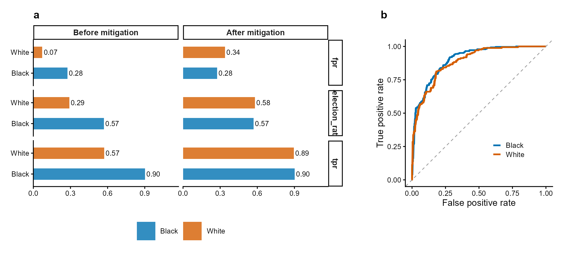

<div align="center">

# clinicalfair

*Algorithmic Fairness Assessment for Clinical Prediction Models*

[](https://github.com/CuiweiG/clinicalfair/actions/workflows/R-CMD-check.yml)
[](https://opensource.org/licenses/MIT)

</div>

---

## Overview

`clinicalfair` is a post-hoc fairness auditing toolkit for clinical
prediction models. It evaluates existing models by computing
group-wise fairness metrics, visualizing disparities, and performing
threshold-based mitigation — motivated by regulatory expectations
for transparency in clinical AI.

- **Metrics**: demographic parity, equalized odds, predictive
  parity, AUC, Brier score
- **Visualization**: disparity plots, ROC by group, calibration
  by group
- **Mitigation**: group-specific threshold optimization
- **Intersectional**: cross-tabulated analysis (race x sex x age)
- **Reporting**: four-fifths rule violation detection

---

<div align="center">

</div>

> **Figure 1 | Fairness audit with threshold mitigation.**
> (**a**) Group-wise selection rate, TPR, and FPR before and
> after equalized-odds threshold optimization. Mitigation
> reduces cross-group TPR disparity while maintaining
> acceptable accuracy. (**b**) ROC curves by racial group
> showing differential model performance. Data: COMPAS-style
> simulated recidivism predictions. Methods: Hardt et al.
> (2016); Obermeyer et al. (2019).

---

## Installation

```r
# From GitHub:
devtools::install_github("CuiweiG/clinicalfair")

# After CRAN acceptance:
install.packages("clinicalfair")
```

## Quick start

```r
library(clinicalfair)
data(compas_sim)

# Create fairness evaluation object
fd <- fairness_data(
    predictions = compas_sim$risk_score,
    labels = compas_sim$recidivism,
    protected_attr = compas_sim$race
)

# Compute metrics
fairness_metrics(fd)

# Generate audit report
fairness_report(fd)

# Mitigate via threshold optimization
threshold_optimize(fd, objective = "equalized_odds")
```

---

<div align="center">

</div>

> **Figure 2 | Calibration curves by racial group.** Each
> point represents a decile bin; point size proportional to
> sample count. Deviation from the diagonal indicates
> miscalibration. Differential calibration across groups is
> a key fairness concern identified by Obermeyer et al.
> (2019) *Science* 366:447.

---

## Key references

- Obermeyer Z et al. (2019). Dissecting racial bias in an
  algorithm. *Science* 366:447. doi:10.1126/science.aax2342
- Hardt M et al. (2016). Equality of Opportunity in Supervised
  Learning. *NeurIPS*.
- FDA (2024). Artificial Intelligence and Machine Learning in
  Software as a Medical Device Action Plan.

## License

MIT
