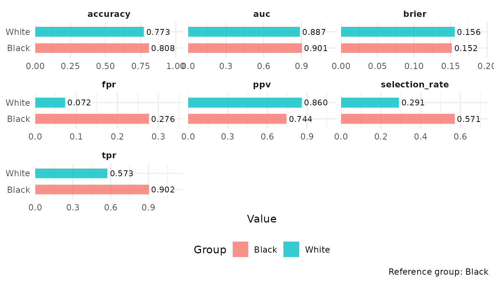
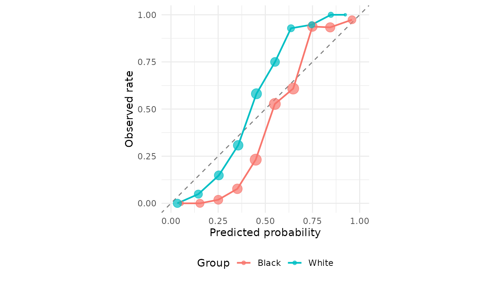

# Algorithmic fairness assessment with clinicalfair

## Overview

clinicalfair evaluates algorithmic fairness of clinical prediction
models across demographic subgroups. It is motivated by regulatory
expectations for transparency in clinical AI evaluation.

## Example: COMPAS recidivism prediction

``` r
library(clinicalfair)
data(compas_sim)
str(compas_sim)
#> 'data.frame':    1000 obs. of  3 variables:
#>  $ risk_score: num  0.486 0.268 0.168 0.189 0.675 ...
#>  $ recidivism: int  1 0 0 0 1 0 1 0 1 0 ...
#>  $ race      : chr  "Black" "Black" "White" "Black" ...
```

## Create fairness data

``` r
fd <- fairness_data(
  predictions    = compas_sim$risk_score,
  labels         = compas_sim$recidivism,
  protected_attr = compas_sim$race
)
fd
#> 
#> ── Fairness evaluation data
#> n = 1000 | prevalence = 0.457
#> Groups: "Black, White"
#> Reference: "Black" | Threshold: 0.5
```

## Compute fairness metrics

``` r
fm <- fairness_metrics(fd)
fm
#> 
#> ── Fairness metrics (reference: Black)
#> # A tibble: 14 × 5
#>    group metric          value ratio difference
#>  * <chr> <chr>           <dbl> <dbl>      <dbl>
#>  1 Black selection_rate 0.571  1        0      
#>  2 Black tpr            0.902  1        0      
#>  3 Black fpr            0.276  1        0      
#>  4 Black ppv            0.744  1        0      
#>  5 Black accuracy       0.808  1        0      
#>  6 Black brier          0.152  1        0      
#>  7 Black auc            0.901  1        0      
#>  8 White selection_rate 0.291  0.510   -0.280  
#>  9 White tpr            0.573  0.635   -0.329  
#> 10 White fpr            0.0724 0.262   -0.204  
#> 11 White ppv            0.860  1.16     0.116  
#> 12 White accuracy       0.773  0.957   -0.0346 
#> 13 White brier          0.156  1.03     0.00381
#> 14 White auc            0.887  0.984   -0.0148
```

## Generate fairness report

``` r
rpt <- fairness_report(fd)
rpt
#> 
#> ── Fairness Report
#> Reference group: "Black"
#> 
#> ! 3 disparity flag(s):
#> White / selection_rate: ratio = 0.51
#> White / tpr: ratio = 0.635
#> White / fpr: ratio = 0.262
#> 
#> 3 metric(s) violate the four-fifths rule (ratio outside [0.8, 1.25]). Consider
#> threshold adjustment or model recalibration.
```

## Visualize disparities

``` r
autoplot(fm)
```



## Group-wise calibration

``` r
plot_calibration(fd)
```



## Threshold optimization

``` r
mit <- threshold_optimize(fd, objective = "equalized_odds")
mit
#> 
#> ── Threshold optimization (equalized_odds)
#> Black: threshold = 0.58
#> White: threshold = 0.42
#> 
#> Accuracy: 0.794 -> 0.808
```

## Intersectional analysis

``` r
set.seed(42)
n <- nrow(compas_sim)
intersectional_fairness(
  predictions = compas_sim$risk_score,
  labels      = compas_sim$recidivism,
  race        = compas_sim$race,
  age_group   = sample(c("Young", "Old"), n, replace = TRUE)
)
#> 
#> ── Fairness metrics (reference: Black x Young)
#> # A tibble: 28 × 5
#>    group         metric         value ratio difference
#>  * <chr>         <chr>          <dbl> <dbl>      <dbl>
#>  1 Black x Old   selection_rate 0.565 0.980   -0.0117 
#>  2 Black x Old   tpr            0.905 1.01     0.00685
#>  3 Black x Old   fpr            0.25  0.827   -0.0525 
#>  4 Black x Old   ppv            0.770 1.07     0.0534 
#>  5 Black x Old   accuracy       0.825 1.04     0.0347 
#>  6 Black x Old   brier          0.141 0.870   -0.0210 
#>  7 Black x Old   auc            0.922 1.05     0.0431 
#>  8 Black x Young selection_rate 0.577 1        0      
#>  9 Black x Young tpr            0.899 1        0      
#> 10 Black x Young fpr            0.302 1        0      
#> # ℹ 18 more rows
```
