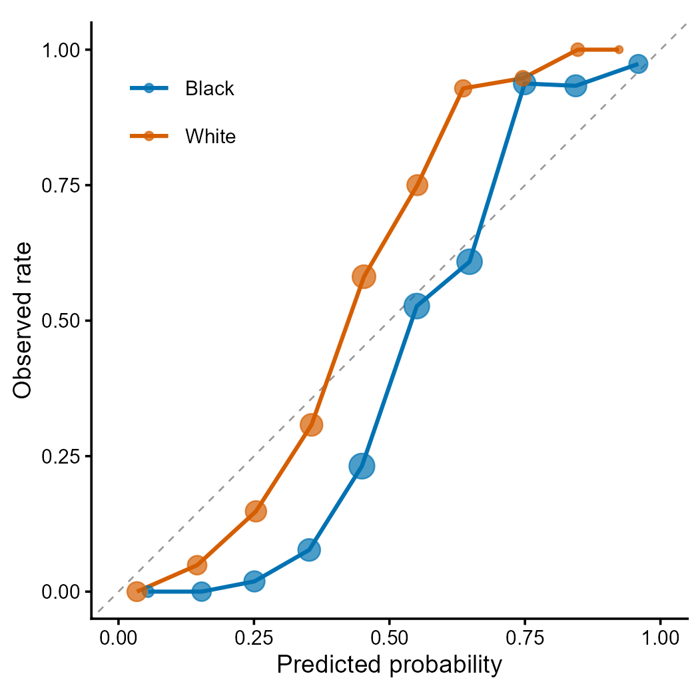

# clinicalfair

*Algorithmic Fairness Assessment for Clinical Prediction Models*

[](https://CRAN.R-project.org/package=clinicalfair)
[](https://CRAN.R-project.org/package=clinicalfair)
[](https://github.com/CuiweiG/clinicalfair/actions/workflows/R-CMD-check.yml)
[](https://opensource.org/licenses/MIT)

![Two-panel fairness audit of the real ProPublica COMPAS dataset
(N=5,787) with three race groups (African-American, Caucasian,
Hispanic). Left panel: selection rate by group with 95% bootstrap
confidence intervals and the four-fifths threshold line; both Caucasian
and Hispanic groups fall below the threshold relative to
African-American as the highest-N reference. Right panel: true-positive
and false-positive rates by group at decile_score \>= 5, showing
systematic disparity in both directions.” /\> \</p\> \<hr /\> \<div
id=](reference/figures/fairness_audit_hero.png)

## Overview

`clinicalfair` is a post-hoc fairness auditing toolkit for clinical
prediction models. It evaluates existing models by computing group-wise
fairness metrics, visualizing disparities, and performing
threshold-based mitigation – motivated by regulatory expectations for
transparency in clinical AI.

- **Metrics**: demographic parity, equalized odds, predictive parity,
  AUC, Brier score – with optional bootstrap confidence intervals
- **Visualization**: disparity plots, ROC by group, calibration by group
- **Mitigation**: group-specific threshold optimization with
  configurable grid resolution (default 0.01)
- **Intersectional**: cross-tabulated analysis (race x sex x age) with
  automatic small-group filtering
- **Reporting**: four-fifths rule violation detection

------------------------------------------------------------------------


> **Figure 1 \| Fairness audit with threshold mitigation.** (**a**)
> Group-wise selection rate, TPR, and FPR before and after
> equalized-odds threshold optimization. Mitigation reduces cross-group
> TPR disparity while maintaining acceptable accuracy. (**b**) ROC
> curves by racial group showing differential model performance. Data:
> COMPAS-style simulated recidivism predictions. Methods: Hardt et al.
> (2016); Obermeyer et al. (2019).

------------------------------------------------------------------------

## Why clinicalfair?

Existing R packages approach fairness from different angles:

| Package       | Focus                             | clinicalfair difference                                                                      |
|---------------|-----------------------------------|----------------------------------------------------------------------------------------------|
| `fairmodels`  | Model-level fairness (wraps mlr3) | clinicalfair is model-agnostic: works with any predicted probabilities                       |
| `fairness`    | Metric computation                | clinicalfair adds threshold mitigation + intersectional analysis                             |
| `fairmetrics` | CIs for fairness metrics          | clinicalfair also provides bootstrap CIs, plus audit reports with four-fifths rule screening |

`clinicalfair` is designed for the **clinical audit use case**: a
clinician or regulator receives a trained model and needs to answer “is
this model fair across patient subgroups?” in one function call, with
actionable output.

``` r
# One-line audit
fairness_report(fairness_data(predictions, labels, race))
```

------------------------------------------------------------------------

## Installation

``` r
# Stable release from CRAN
install.packages("clinicalfair")

# Development version from GitHub
# devtools::install_github("CuiweiG/clinicalfair")
```

## Quick start

``` r
library(clinicalfair)
data(compas_sim)

# Create fairness evaluation object
fd <- fairness_data(
    predictions = compas_sim$risk_score,
    labels = compas_sim$recidivism,
    protected_attr = compas_sim$race
)

# Compute metrics
fairness_metrics(fd)

# With bootstrap confidence intervals
fairness_metrics(fd, ci = TRUE, n_boot = 2000)

# Generate audit report
fairness_report(fd)

# Mitigate via threshold optimization
threshold_optimize(fd, objective = "equalized_odds")
```

------------------------------------------------------------------------



> **Figure 2 \| Calibration curves by racial group.** Each point
> represents a decile bin; point size proportional to sample count.
> Deviation from the diagonal indicates miscalibration. Differential
> calibration across groups is a key fairness concern identified by
> Obermeyer et al. (2019) *Science* 366:447.

------------------------------------------------------------------------

## Functions

| Function                                                                                                   | Description                                                        |
|------------------------------------------------------------------------------------------------------------|--------------------------------------------------------------------|
| [`fairness_data()`](https://cuiweig.github.io/clinicalfair/reference/fairness_data.md)                     | Bundle predictions, labels, protected attributes                   |
| [`fairness_metrics()`](https://cuiweig.github.io/clinicalfair/reference/fairness_metrics.md)               | Compute group-wise fairness metrics (optional bootstrap CIs)       |
| [`fairness_report()`](https://cuiweig.github.io/clinicalfair/reference/fairness_report.md)                 | Generate audit report with four-fifths rule screening              |
| [`threshold_optimize()`](https://cuiweig.github.io/clinicalfair/reference/threshold_optimize.md)           | Group-specific threshold mitigation (configurable grid resolution) |
| [`intersectional_fairness()`](https://cuiweig.github.io/clinicalfair/reference/intersectional_fairness.md) | Cross-tabulated multi-attribute analysis (small-group filtering)   |
| [`autoplot()`](https://ggplot2.tidyverse.org/reference/autoplot.html)                                      | Disparity bar plots (S3 method)                                    |
| [`plot_roc()`](https://cuiweig.github.io/clinicalfair/reference/plot_roc.md)                               | ROC curves by protected group                                      |
| [`plot_calibration()`](https://cuiweig.github.io/clinicalfair/reference/plot_calibration.md)               | Calibration curves by group                                        |

------------------------------------------------------------------------

## Key references

- Obermeyer Z et al. (2019). Dissecting racial bias in an algorithm.
  *Science* 366:447. <doi:10.1126/science.aax2342>
- Hardt M et al. (2016). Equality of Opportunity in Supervised Learning.
  *NeurIPS*.
- FDA (2021). Artificial Intelligence/Machine Learning (AI/ML)-Based
  Software as a Medical Device (SaMD) Action Plan.

## License

MIT
